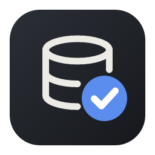

<div align="center">



# SQLAudit

**Change your database without the fear.**<br>
Preview every change, back it up automatically, and undo it any time.

[](https://github.com/YourJunny/SQLAudit/releases/latest)
[](https://github.com/YourJunny/SQLAudit/releases)


</div>

---

## Download

| Platform | Download | Notes |
| --- | --- | --- |
| **Windows** 10 / 11 | [SQLAudit-Windows-Setup.exe](https://github.com/YourJunny/SQLAudit/releases/latest/download/SQLAudit-Windows-Setup.exe) | 64-bit |
| **macOS** 10.15+ | [SQLAudit-macOS.dmg](https://github.com/YourJunny/SQLAudit/releases/latest/download/SQLAudit-macOS.dmg) | Apple silicon and Intel |
| **Linux** | [SQLAudit-Linux.AppImage](https://github.com/YourJunny/SQLAudit/releases/latest/download/SQLAudit-Linux.AppImage) | Most distros |

Download the file for your computer and open it. There's nothing else to install, and the app keeps
itself up to date. When a new version comes out you'll get a **Restart to update** button.

## How it works

1. **Describe the change.** Type it in plain English, write the SQL yourself, or just edit cells in the grid.
2. **See exactly what happens.** SQLAudit runs it as a dry run first and shows you every row that
   would change, including anything that cascades from it.
3. **Confirm it.** You type a short code to apply it, so nothing goes through by accident.
4. **Undo it whenever.** Every changed row is backed up first, so any change can be reverted from History.

## Features

**Databases**
- SQLite, PostgreSQL and MySQL / MariaDB
- Several databases open at once, with color-coded tabs
- Read-only and production profiles for the ones you don't want to touch

**Editing**
- Plain-English changes, a SQL editor, and a spreadsheet-style grid
- A visual query builder and change templates
- Find and replace, plus column cleanup (trim, case, split, merge, dates, regex)
- A sandbox copy for trying things safely

**Safety**
- A dry run and preview before anything is written
- Row-by-row backups and one-click undo
- A full audit log, plus time travel through a table's history
- Team review, so someone else can approve a change before it's applied
- Validation rules and warnings when something looks off

**Import and export**
- Import CSV, JSON, SQL, Excel and OpenDocument files
- Export to CSV, TSV, JSON, Excel, Markdown and HTML

**Everything else**
- Schema compare with a migration script generator
- Database health checks and column stats
- Dashboards, scheduled changes and webhooks (Slack, Discord, JSON)
- Nine themes, a text size setting, and keyboard shortcuts for everything (Ctrl/⌘ K)
- A command-line tool with a local API

## New to SQLAudit?

Open the **Practice** tab. It comes with a sample store database you can experiment on as much as
you want (there's a reset button), and a checklist that walks you through the main features one at a
time. There's also a guided tour if you'd rather be shown around.

## Opening it for the first time

SQLAudit isn't code-signed yet, so your computer will ask you to confirm once:

<details>
<summary><b>Windows</b></summary>

If you see "Windows protected your PC", click **More info**, then **Run anyway**.
</details>

<details>
<summary><b>macOS</b></summary>

1. Open the `.dmg` and drag SQLAudit into **Applications**.
2. Open SQLAudit. When macOS says it can't verify the app, click **Done**.
3. Go to **System Settings > Privacy & Security**, scroll down, and click **Open Anyway** next to SQLAudit.

You only need to do this once.
</details>

<details>
<summary><b>Linux</b></summary>

Right-click the AppImage, open **Properties**, and allow it to run as a program. Or from a terminal:

```sh
chmod +x SQLAudit-Linux.AppImage && ./SQLAudit-Linux.AppImage
```
</details>

## Privacy

SQLAudit runs on your computer. Your databases stay where they are, and passwords and API keys are
stored in your system's keychain, not in plain files. The AI features are optional. You can use a
free local model through [Ollama](https://ollama.com/download) or bring your own API key.

## Support

Found a bug or have an idea? [Open an issue](https://github.com/YourJunny/SQLAudit/issues/new).
Please include your operating system and SQLAudit version (**Settings > About**).

---

<div align="center">
<sub>SQLAudit is closed source. This repository hosts the official downloads.</sub>
</div>
